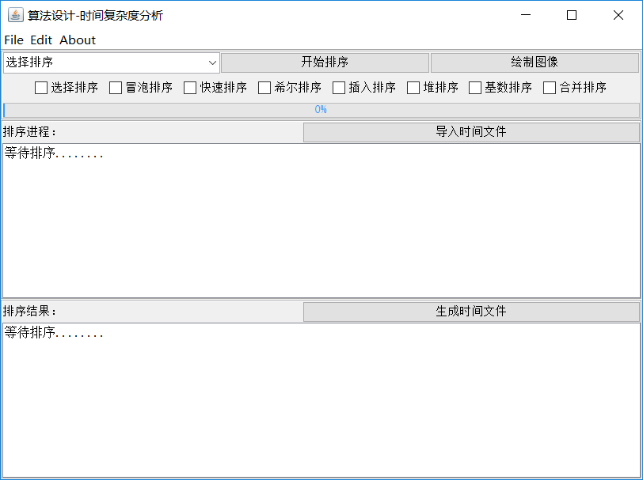
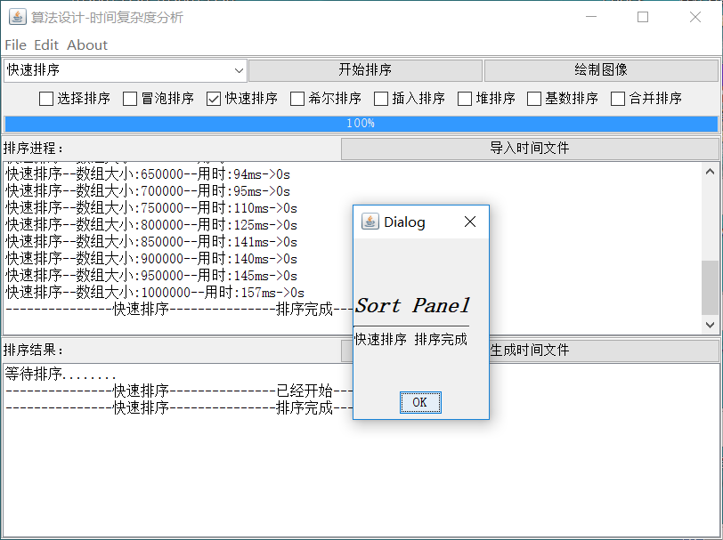
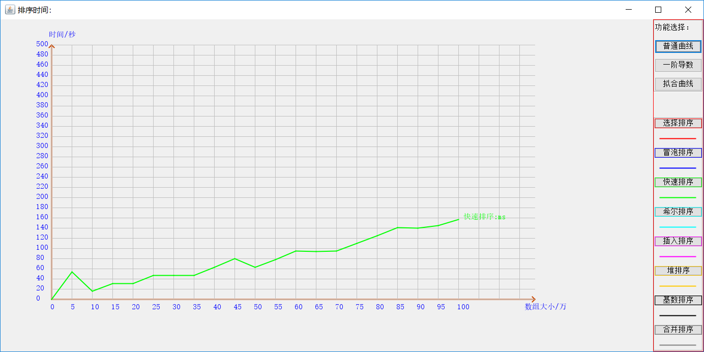

# Sort-Swing

> 这是一个使用JavaSwing组件实现的桌面应用，它能够进行八种排序的时间复杂度计算，并将结果绘制图线或持久化到文件，最后对比八种算法的性能。

## 部署运行
```txt
# Clone Project
git clone https://github.com/kevinten10/Sort-Swing

# 启动
com.ten.sort: 运行Sort.java的main方法
```

## 其他DEMO

> com.ten.domo文件下为基于Swing编程的实例应用，用于学习相关的方法

## 功能概述 
* 八大排序算法
* 进度检测
* 执行结果文件的保存和读取
* 曲线的绘制
* 曲线导数计算 绘制
* 曲线拟合计算 绘制
* 多线程操作

## 操作流程 
* 选择排序方式 或 导入文件
* 点击按钮
* 排序完成-->点击 绘制曲线
* 三种功能 和 生成文件

## 主界面





### 绘图界面




