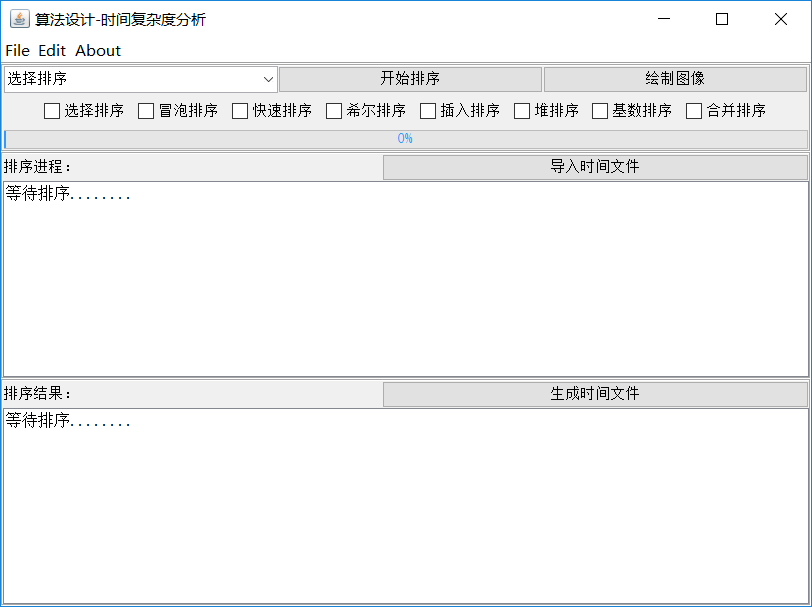
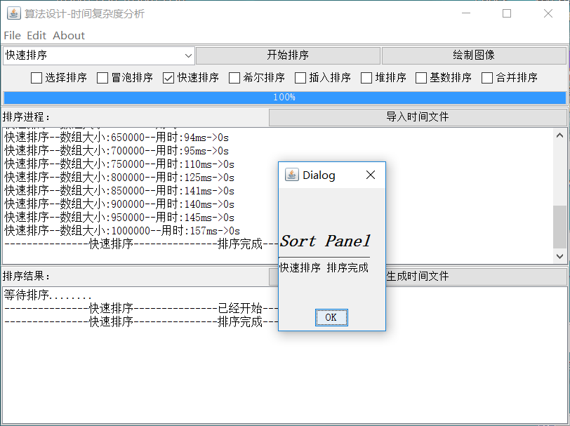
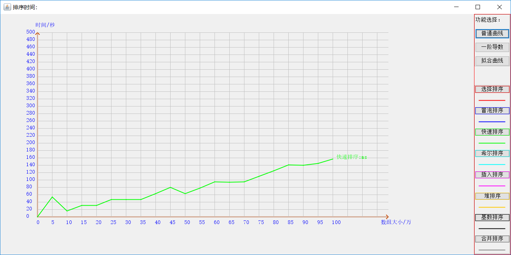

# Java Swing 实现可视化排序器 #
------
### 简介 ###
* 操作流程
* 主界面
* 绘图界面

#### 功能概述 ####
* 八大排序算法
* 进度检测
* 执行结果文件的保存和读取
* 曲线的绘制
* 曲线导数计算 绘制
* 曲线拟合计算 绘制
* 多线程操作

#### 1.操作流程 ####
* 选择排序方式 或 导入文件
* 点击按钮
* 排序完成-->点击 绘制曲线
* 三种功能 和 生成文件

#### 2.主界面 ####

#### 3.绘图界面 ####

------
### 功能 ###

#### 1.功能概述 ####
* 八大排序算法
* 进度检测
* 执行结果文件的保存和读取
* 曲线的绘制
* 曲线导数计算 绘制
* 曲线拟合计算 绘制
* 多线程操作

#### 2.具体方法 ####

------
### 代码分析 ###
* 排序算法
* 界面代码

#### 1.排序算法 ####

#### 2.Swing代码 ####
